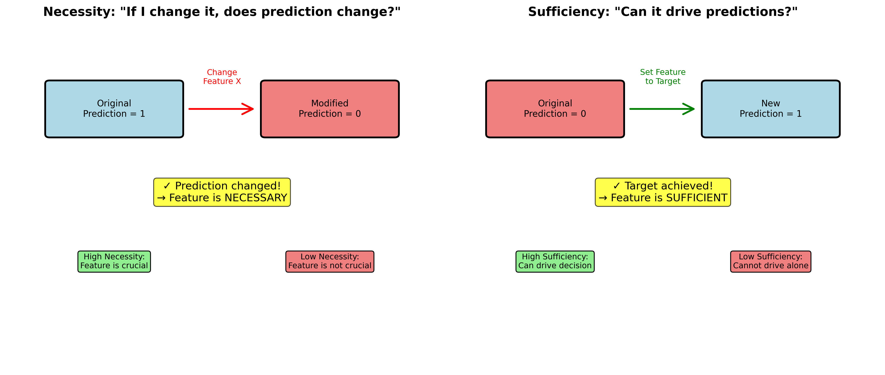
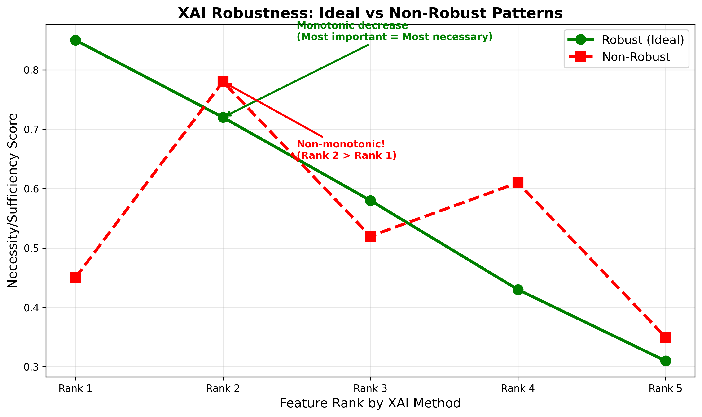

# Necessity and Sufficiency Analysis for XAI Robustness

A complete implementation of necessity and sufficiency metrics for evaluating the robustness of explainable AI (XAI) methods, specifically LIME and SHAP, on tabular data.

[](https://www.python.org/downloads/)
[](https://opensource.org/licenses/MIT)

## 📚 Overview

This repository implements the methodologies from two key papers:

1. **Chowdhury et al. (2023)** - "Explaining Explainers: Necessity and Sufficiency in Tabular Data"
   - NeurIPS 2023 Workshop on Table Representation Learning
   
2. **Chowdhury et al. (2025)** - "A unified framework for evaluating the robustness of machine-learning interpretability for prospect risking"
   - Geophysics, Vol. 90, No. 3

### What This Framework Does

This framework provides:
- **Necessity Scores**: Quantifies how essential each feature is for a model's prediction
- **Sufficiency Scores**: Quantifies how much a feature alone can drive predictions
- **Robustness Analysis**: Evaluates whether LIME and SHAP explanations align with necessity/sufficiency
- **Forward Counterfactuals**: Generates counterfactuals without requiring target predictions

## 🎯 Key Concepts

### Necessity
> "If I change this feature, will the model's prediction change?"

A feature has **high necessity** if altering its value consistently flips the model's decision. Mathematically:

```
Necessity(x_j) = P(y ≠ y* | x_j ← a')
```

Where:
- `x_j` is the feature being evaluated
- `y*` is the original prediction
- `a'` is a perturbed value

### Sufficiency
> "If I set this feature to a specific value, can it guarantee a certain prediction?"

A feature has **high sufficiency** if setting it to a target value reliably produces the desired outcome:

```
Sufficiency(x_j) = P(y = y* | x_j ← a)
```

### Robustness Hypothesis

**An important feature should be both necessary AND sufficient.**

If LIME or SHAP ranks a feature as highly important, we expect:
1. Its necessity score to be high (changing it affects predictions)
2. Its sufficiency score to be high (it can drive predictions)

## 📊 Example Results

### Global Necessity and Sufficiency Scores

The framework calculates global scores for each feature by aggregating local counterfactual interventions:



### Robustness Analysis

The framework evaluates whether top-ranked features by LIME/SHAP are truly necessary and sufficient:



**Ideal Robustness**: Scores should decrease monotonically with rank (Rank 1 > Rank 2 > Rank 3...)

## 🚀 Quick Start

### Installation

```bash
# Clone the repository
git clone https://github.com/yourusername/necessity-sufficiency-xai.git
cd necessity-sufficiency-xai

# Create virtual environment
python -m venv venv
source venv/bin/activate  # On Windows: venv\Scripts\activate

# Install dependencies
pip install -r requirements.txt
```

### Basic Usage

Run analysis on the Breast Cancer dataset with Logistic Regression:

```bash
cd src
python main.py --dataset breast_cancer --model logistic
```

Run with different configurations:

```bash
# Random Forest on Breast Cancer
python main.py --dataset breast_cancer --model random_forest

# Gaussian Naive Bayes on Iris
python main.py --dataset iris --model gaussian_nb

# Custom parameters
python main.py --dataset breast_cancer --model logistic \
    --n_samples 200 --top_k 7 --output_dir ../my_results
```

### Command Line Arguments

| Argument | Default | Description |
|----------|---------|-------------|
| `--dataset` | `breast_cancer` | Dataset to use: `breast_cancer`, `iris` |
| `--model` | `logistic` | Model type: `logistic`, `random_forest`, `gaussian_nb` |
| `--n_samples` | `100` | Number of samples for global score calculation |
| `--top_k` | `5` | Number of top features for robustness analysis |
| `--output_dir` | `results` | Directory to save results |

## 📁 Repository Structure

```
necessity-sufficiency-xai/
├── src/
│   ├── main.py                      # Main analysis script
│   ├── counterfactual_generator.py  # Forward CF generation
│   ├── xai_evaluator.py             # LIME/SHAP robustness evaluation
│   └── visualization.py             # Plotting utilities
├── notebooks/
│   ├── 01_introduction.ipynb        # Introduction and concepts
│   ├── 02_toy_example.ipynb         # Validation with logical operators
│   └── 03_full_analysis.ipynb       # Complete analysis walkthrough
├── data/
│   └── README.md                    # Data description
├── results/
│   └── (generated outputs)          # Analysis results
├── images/
│   └── (figures and diagrams)       # Documentation images
├── docs/
│   ├── methodology.md               # Detailed methodology
│   └── api_reference.md             # API documentation
├── requirements.txt                 # Python dependencies
└── README.md                        # This file
```

## 📖 Detailed Methodology

### 1. Forward Counterfactual Generation

Unlike traditional counterfactual methods (e.g., DiCE) that optimize towards a target prediction, our forward approach:

```python
# Traditional CF: Find x' such that f(x') = target_y
# Forward CF: Perturb x_j and observe f(x')

# For necessity
for instance in dataset:
    for feature in features:
        perturb_feature(instance, feature)
        if prediction_changed():
            necessity_score += 1
```

**Advantages**:
- No need for target predictions
- Works on sparse, high-dimensional data
- No causal model required
- Computationally efficient

### 2. Global Score Calculation

Global scores aggregate local counterfactual results:

```python
Global_Necessity(x_j) = (1/N) Σ Local_Necessity(x_j, instance_i)
```

Where N is the number of sampled instances.

### 3. XAI Robustness Evaluation

For each test instance:
1. Get LIME/SHAP feature rankings
2. Map rankings to global necessity/sufficiency scores
3. Evaluate if scores decrease monotonically with rank

## 🔬 Validation with Toy Examples

The framework is validated using synthetic data with known logical relationships:

### Logical AND

```python
Y = X2 AND X3  # Output is 1 only if both inputs are 1

Expected:
- Necessity = 100% (changing either input changes output)
- Sufficiency = 33.3% (both must be 1 for output 1)
```

### Logical OR

```python
Y = X2 OR X3  # Output is 1 if either input is 1

Expected:
- Necessity = 33.3% (only matters when both are 0)
- Sufficiency = 66.7% (either input can produce output)
```

See `notebooks/02_toy_example.ipynb` for complete validation.

## 📊 Interpreting Results

### Global Scores

**High Necessity + High Sufficiency**
- Feature is crucial for model decisions
- Strong causal relationship
- Should be top-ranked by XAI methods

**High Necessity + Low Sufficiency**
- Feature is important but not alone sufficient
- Part of feature interactions
- May require other features

**Low Necessity + High Sufficiency**
- Feature can drive decisions but isn't always needed
- Model may have alternative decision paths
- Could indicate redundancy

**Low Necessity + Low Sufficiency**
- Feature is not important for model
- Should not be top-ranked by XAI methods

### Robustness Analysis

**Robust Explanation** (Ideal):
```
Rank 1: 0.85 ← Highest
Rank 2: 0.72
Rank 3: 0.58
Rank 4: 0.43
Rank 5: 0.31 ← Lowest
```

**Non-Robust Explanation**:
```
Rank 1: 0.45 ← Not highest!
Rank 2: 0.78 ← Higher than Rank 1
Rank 3: 0.52
Rank 4: 0.61 ← Non-monotonic
Rank 5: 0.35
```

## 🎓 Citation

If you use this code in your research, please cite:

```bibtex
@inproceedings{chowdhury2023explaining,
  title={Explaining Explainers: Necessity and Sufficiency in Tabular Data},
  author={Chowdhury, Prithwijit and Prabhushankar, Mohit and AlRegib, Ghassan},
  booktitle={NeurIPS 2023 Second Table Representation Learning Workshop},
  year={2023}
}

@article{chowdhury2025unified,
  title={A unified framework for evaluating the robustness of machine-learning interpretability for prospect risking},
  author={Chowdhury, Prithwijit and Mustafa, Ahmad and Prabhushankar, Mohit and AlRegib, Ghassan},
  journal={Geophysics},
  volume={90},
  number={3},
  pages={IM103--IM118},
  year={2025},
  publisher={Society of Exploration Geophysicists}
}
```

## 📚 Related Work

### Key References

1. **LIME**: Ribeiro et al. (2016) - "Why Should I Trust You?" Explaining the Predictions of Any Classifier
2. **SHAP**: Lundberg & Lee (2017) - "A Unified Approach to Interpreting Model Predictions"
3. **Actual Causality**: Halpern (2016) - "Actual Causality"
4. **Counterfactuals**: Wachter et al. (2017) - "Counterfactual Explanations without Opening the Black Box"

### Philosophical Foundations

- **Swartz (1997)**: "The Concepts of Necessary Conditions and Sufficient Conditions"
- **Pearl (2009)**: "Causality: Models, Reasoning and Inference"

## 🛠️ Advanced Usage

### Using Custom Datasets

```python
from counterfactual_generator import ForwardCounterfactualGenerator, GlobalScoreCalculator
import numpy as np

# Load your data
X_train, y_train = load_your_data()
X_test, y_test = load_your_test_data()

# Train your model
from sklearn.ensemble import GradientBoostingClassifier
model = GradientBoostingClassifier()
model.fit(X_train, y_train)

# Initialize CF generator
cf_gen = ForwardCounterfactualGenerator(
    model=model,
    feature_names=['feature1', 'feature2', ...],
    n_perturbations=50
)

# Calculate global scores
calculator = GlobalScoreCalculator(cf_gen)
necessity, sufficiency = calculator.calculate_all_global_scores(
    X_test, y_test, n_samples=100
)
```

### Custom Robustness Analysis

```python
from xai_evaluator import XAIRobustnessEvaluator

# Initialize evaluator
evaluator = XAIRobustnessEvaluator(
    model=model,
    X_train=X_train,
    feature_names=feature_names
)

# Run robustness analysis
results = evaluator.full_robustness_evaluation(
    X_test=X_test,
    necessity_scores=necessity,
    sufficiency_scores=sufficiency,
    top_k=7,
    n_samples=100
)
```

## 🐛 Troubleshooting

### Common Issues

**Issue**: SHAP kernel explainer is slow
```python
# Solution: Reduce background sample size
shap_explainer = shap.KernelExplainer(
    model.predict_proba,
    shap.sample(X_train, 50)  # Reduced from 100
)
```

**Issue**: Memory error with large datasets
```python
# Solution: Reduce n_samples
python main.py --dataset large_data --n_samples 50
```

**Issue**: LIME explanations vary significantly
```python
# Solution: Increase num_samples in LIME
lime_explainer.explain_instance(
    instance,
    model.predict_proba,
    num_samples=5000  # Increased from default
)
```

## 🤝 Contributing

Contributions are welcome! Please:

1. Fork the repository
2. Create a feature branch (`git checkout -b feature/amazing-feature`)
3. Commit your changes (`git commit -m 'Add amazing feature'`)
4. Push to the branch (`git push origin feature/amazing-feature`)
5. Open a Pull Request

## 📄 License

This project is licensed under the MIT License - see the [LICENSE](LICENSE) file for details.

## 👥 Authors

- **Prithwijit Chowdhury** - Georgia Institute of Technology
- **Mohit Prabhushankar** - Georgia Institute of Technology  
- **Ghassan AlRegib** - Georgia Institute of Technology
- **Ahmad Mustafa** - Occidental Petroleum (for geophysics paper)

## 🙏 Acknowledgments

- This work is based on research conducted at the Omni Lab for Intelligent Visual Engineering and Science (OLIVES) at Georgia Tech
- Supported by the ML4Seismic Consortium and the Center for Energy and Geo Processing (CeGP)
- Thanks to the DHI Risk Analysis Consortium for providing data for the geophysics study

## 📧 Contact

For questions or issues, please:
- Open an issue on GitHub
- Contact: pchowdhury6@gatech.edu

## 🔗 Links

- [Paper 1: NeurIPS 2023 Workshop](https://openreview.net/forum?id=example)
- [Paper 2: Geophysics Journal](https://doi.org/10.1190/geo2024-0020.1)
- [OLIVES Lab](https://ghassanalregib.info/)
- [Georgia Tech ECE](https://ece.gatech.edu/)

---

**Keywords**: XAI, Explainability, Interpretability, LIME, SHAP, Necessity, Sufficiency, Counterfactuals, Tabular Data, Machine Learning, Robustness
